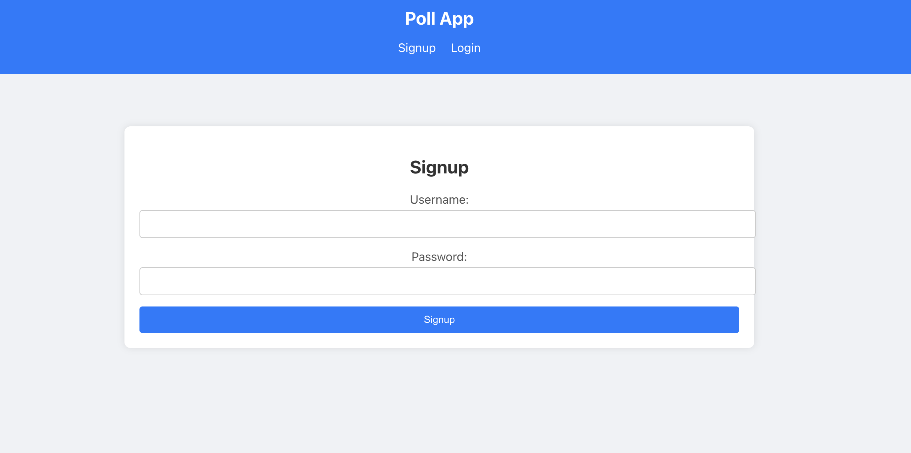
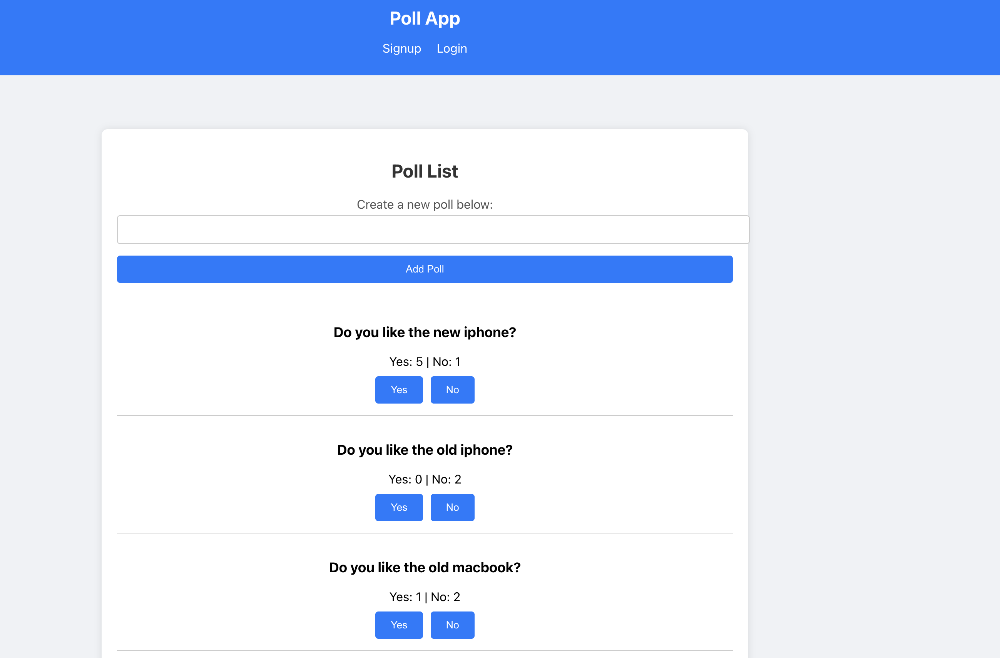
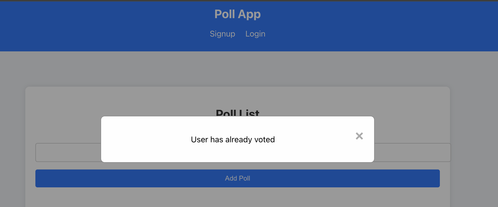
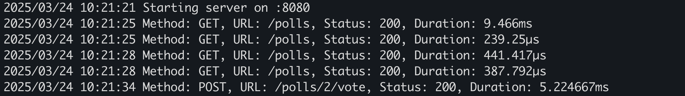

# Polling App

Polling App is a full-stack application built with a Go backend and a React frontend. The backend connects to a PostgreSQL database and provides RESTful API endpoints, while the frontend serves as the user interface to interact with the app.







## Getting Started

### Prerequisites
- Go 1.16 or later
- Node.js and npm
- PostgreSQL

---

## Backend Setup

### Installation
1. Clone the repository:

    ```bash
    git clone https://github.com/yourusername/polling-app.git
    cd polling-app/backend
    ```

2. Install Go dependencies:

    ```bash
    go mod tidy
    ```

3. Set up your PostgreSQL database and update the connection details in the `repository` package. The credentials of the database can be setup in the below file

    `config/config.go`

---

### Running the Backend
1. Start the backend server:

    ```bash
    go run main.go
    ```

2. The backend server runs on port `8080`. API is accessible at:

    ```
    http://localhost:8080
    ```

---

## Frontend Setup

### Installation
1. Navigate to the frontend project directory:

    ```bash
    cd ../ui
    ```

2. Install Node.js dependencies:

    ```bash
    npm install
    ```

---

### Running the Frontend
1. Start the development server:

    ```bash
    npm start
    ```

2. Open your browser and navigate to:

    ```
    http://localhost:3000
    ```

---

## Middleware (Backend)

- **CORS**: Configured to allow all origins, specific methods, and headers.
- **Logging**: Logs the success or failure of each API call, including method, URL, status, and duration.


